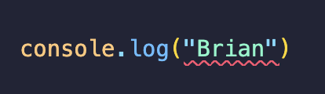

# eslint-plugin-no-brian

ESLint plugin that flags all instances of "Brian" in your code.



## Installation

```bash
npm i -D eslint-plugin-no-brian
```

## Usage

```javascript
// eslint.config.js

import { defineConfig, globalIgnores } from "eslint/config";
import noBrian from "eslint-plugin-no-brian";

const eslintConfig = defineConfig([
  noBrian.configs.recommended,
  globalIgnores([
    // Ignore the config file to avoid self-reference
    "eslint.config.*",
  ]),
]);

export default eslintConfig;
```

## Commands

### Run ESLint

Run ESLint on your codebase.

```bash
eslint .
```

### Run ESLint with Fix

Remove all instances of "Brian" from your code.

```bash
eslint . --fix
```

## Custom configuration

```javascript
{
  rules: {
    'no-brian/no-invalid-strings': ['error', ['Brian', 'brian', 'other-name']]
  }
}
```

## License

MIT
